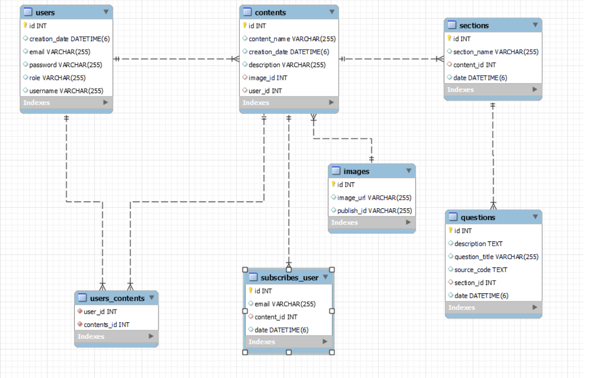

## Service To Share Interviews Questions

---

#### `InterviewLand-API`
* A super admin in the program and this super admin can add an instructor to the system.
* Instructors add interview questions in a programming language of their choice.
* Users can see and read these questions without logging into the system.

---


## Database Architecture

---



---

## Documentation

---


Postman :
https://documenter.getpostman.com/view/21835802/2s93JusMn5
---

## Technologies

---
- Java 11
- Kotlin 1.5.10 
- Spring Boot 2.5.4
- Cloudinary
- Spring Security
- Mail Sender
- Docker
- Docker Compose
- Open API Documentation
- Spring Data JPA
- Validation
- MySQL
- Restful API
- Maven
- Junit5
- Mockito
- Integration Tests
- Github Actions


## Prerequisites

---
Maven or Docker

---

## Docker Run
The application can be built and run by the `Docker` engine. The `Dockerfile` has multistage build, so you do not need to build and run separately.

Please follow the below directions in order to build and run the application with Docker Compose;

```sh
$ cd interviewland-backend
$ docker-compose up -d
```


---
## Maven Run
To build and run the application with `Maven`, please follow the directions below;

```sh
$ cd interviewland-backend
$ mvn clean install
$ mvn spring-boot:run
```
